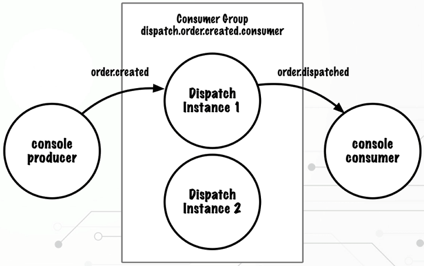
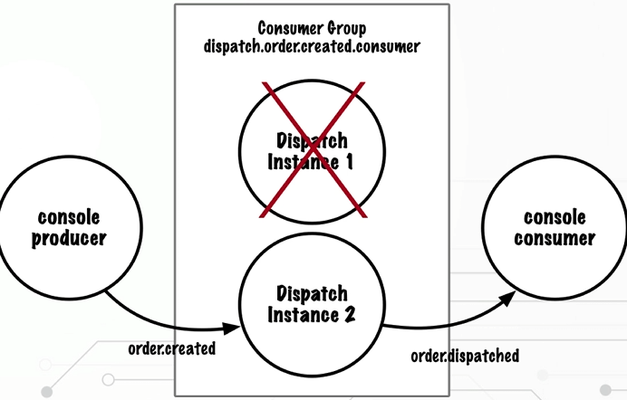
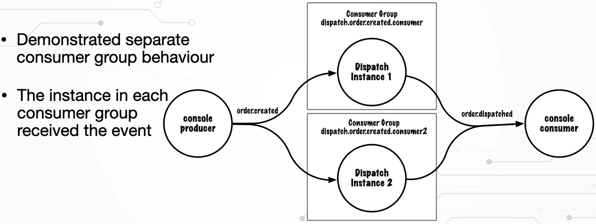

# Spring Boot Kafka Integration

This project is a simple example of how to integrate Kafka with Spring Boot.

<br />

## 📚 Table of Contents

- [Installation](https://github.com/glenncai/spring-boot-kafka-integration#-installation)
- [Consumer](https://github.com/glenncai/spring-boot-kafka-integration#-consumer)

<br />

## 🔧 Installation

Windows:

- First, you need to download Kafka from [here](https://kafka.apache.org/downloads) by selecting `Binary downloads` and
  then `kafka_xxx-xxx.tgz`.
- Extract the downloaded file to a directory of your choice.
- Open a terminal and navigate to the directory where you extracted the file.
- Configure the `config/server.properties` file by changing the following properties:
  ```properties
  port = 9092
  advertised.host.name = localhost
  log.dirs=path to kafka/kafka-logs
  ```
- Configure the `config/zookeeper.properties` file by changing the following properties:
  ```properties
  dataDir=path to kafka/zookeeper-data
  ```
- Run the following command to start Zookeeper:
  ```shell
  bin\windows\zookeeper-server-start.bat config\zookeeper.properties
  ```
- Run the following command to start Kafka:
  ```shell
  bin\windows\kafka-server-start.bat config\server.properties
  ```

<br />

## 📡 Consumer

#### Shared Consumer Group

Only one instance in a consumer group received the event.



#### Consumer Failover

When we kill the assigned consumer, the other consumer will take over the event.



#### Duplicate Consumption

The same event is consumed by both consumers.

