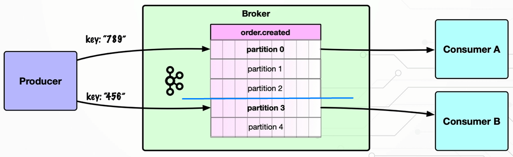
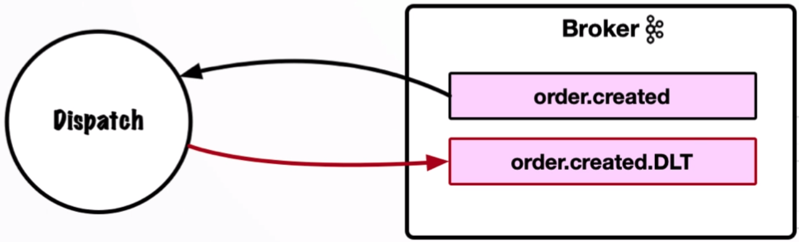

# Spring Boot Kafka Integration

This project is a simple example of how to integrate Kafka with Spring Boot.

## 📚 Table of Contents

- [Installation](https://github.com/glenncai/spring-boot-kafka-integration#-installation)
- [Consumer](https://github.com/glenncai/spring-boot-kafka-integration#-consumer)
- [Keys and Partitions](https://github.com/glenncai/spring-boot-kafka-integration#-keys-and-partitions)
- [Dead Letter Topic](https://github.com/glenncai/spring-boot-kafka-integration#-dead-letter-topic)
- [WireMock Standalone](https://github.com/glenncai/spring-boot-kafka-integration#-wiremock-standalone)

## 🔧 Installation

Windows:

- First, you need to download Kafka from [here](https://kafka.apache.org/downloads) by selecting `Binary downloads` and
  then `kafka_xxx-xxx.tgz`.
- Extract the downloaded file to a directory of your choice.
- Open a terminal and navigate to the directory where you extracted the file.
- Configure the `config/server.properties` file by changing the following properties:
  ```properties
  port = 9092
  advertised.host.name = localhost
  log.dirs=path to kafka/kafka-logs
  ```
- Configure the `config/zookeeper.properties` file by changing the following properties:
  ```properties
  dataDir=path to kafka/zookeeper-data
  ```
- Run the following command to start Zookeeper:
  ```shell
  bin\windows\zookeeper-server-start.bat config\zookeeper.properties
  ```
- Run the following command to start Kafka:
  ```shell
  bin\windows\kafka-server-start.bat config\server.properties
  ```

## 📡 Consumer

#### Shared Consumer Group

Only one instance in a consumer group received the event.


#### Consumer Failover

When we kill the assigned consumer, the other consumer will take over the event.


#### Duplicate Consumption

The same event is consumed by both consumers.


## 🔑 Keys and Partitions

- Topics are composed of 1 or more partitions
- Messages are written to a partition
- To guarantee order:
  - Messages to be on the same partition
  - Achieved via Message Key



## 📪 Dead Letter Topic

Naming convention: <original.topic>.DLT



## 📍 WireMock Standalone

Setup WireMock guide can be found [here](https://github.com/glenncai/kafka-integration-wiremock#run-the-wiremock).

### Commandline Demo

Start Spring Boot application.

```shell
mvn spring-boot:run
```

Start the Kafka server with Zookeeper.

```shell
bin\windows\kafka-server-start.bat config\kraft\server.properties
```

```shell
bin\windows\kafka-server-start.bat config\server.properties
```

Start consumer by running the following command:

```shell
bin\windows\kafka-console-consumer.bat --topic order.dispatched --bootstrap-server localhost:9092 --property print.key=true --property key.separator=:
```

Start producer by running the following command:

```shell
bin\windows\kafka-console-producer.bat --topic order.created --bootstrap-server localhost:9092 --property parse.key=true --property key.separator=:
```

Send a message:

HttpStatus: `200` -> `Success`

```shell
"200":{"orderId":"8ed0dc67-41a4-4468-81e1-960340d30c92","item":"item_200"}
```

HttpStatus: `400` -> `NotRetryableException`

```shell
"400":{"orderId":"8ed0dc67-41a4-4468-81e1-960340d30c92","item":"item_400"}
```

HttpStatus: `502` -> `RetryableException`

```shell
"502":{"orderId":"8ed0dc67-41a4-4468-81e1-960340d30c92","item":"item_502"}
```